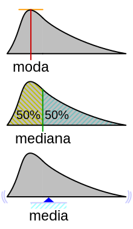
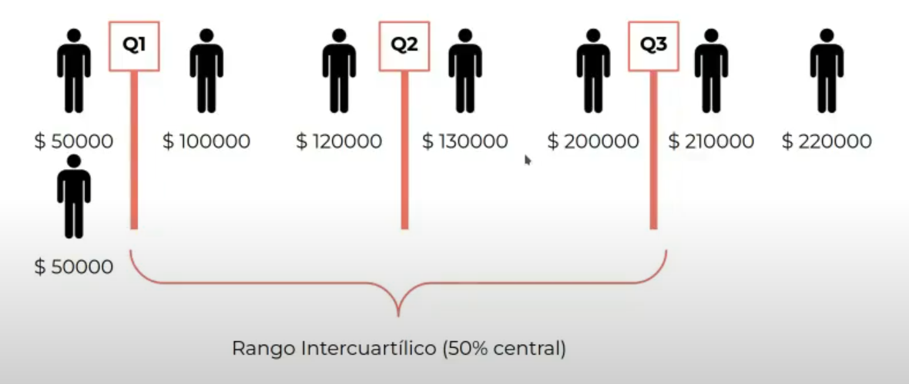
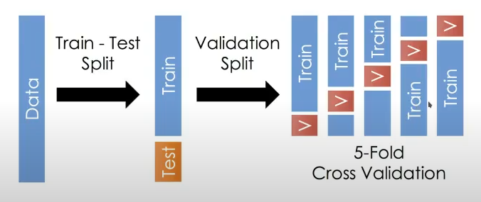
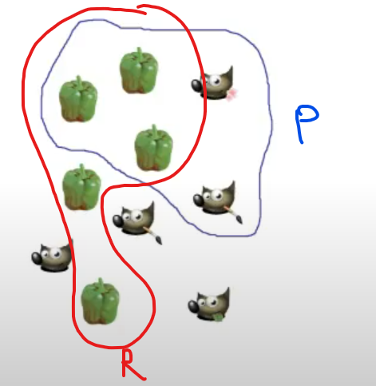
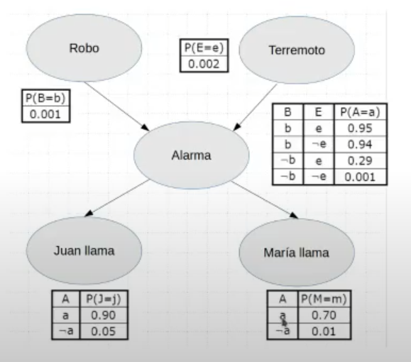
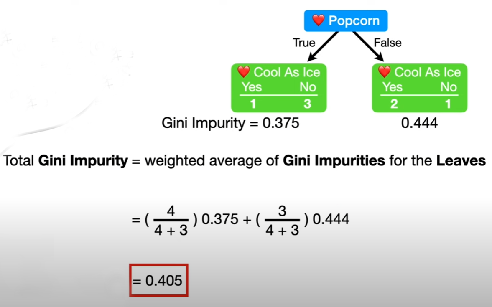

# Cheat Sheet

## Cálculos útiles:

- Media: El promedio.

- Moda: Valor más común.

- Mediana: Es el valor que está en mitad de la población.

- Cuartil: Valores que dejan al 25% de la población entre ellos.

- Rango Intercuartílico: El rango entre el cuartil 1 y 3.

- Varianza: Promedio de la diferencia entre todas las observaciones respecto de su media.

- Correlación de Pearson: valor entre -1 y 1 que indica la correlación entre dos variables. Se calcula como:

$
\text{Pearson}(X,Y) = \frac{\text{Cov}(X,Y)}{\sqrt{\text{Var}(X) \cdot \text{Var}(Y)}}
$

Cuanto más baja es la desviación estándar, más cerca están los datos de la media.

 

 

Vemos en la siguiente imagen, que por ejemplo $Q_1 = 87500$ 

 

 

Los cuartiles dividen la información en cuatro grupos de igual tamaño. El segundo cuartil es igual a la media.

## Paradoja de Simpson

Al momento de decidir si sacar piedras del riñón mediante cirugía abierta (78% de éxito) versus inyección al riñón (83% de éxito), uno creería que siempre debemos utilizar este último método. Sin embargo, cuando se analiza lo que ocurre, en función de si las piedras son mayores o menores a 2cm, aparenta que siempre debemos utilizar la cirugía abierta.

Lo que pasaba acá es que dos variables no relacionadas, cambian totalmente de tendencia al relacionarlas con una variable nueva. 

Se puede solucionar haciendo validación cruzada, lo que significaría darle tratamientos random a todo el mundo, por muy poco ético que esto resulte y comparar los resultados finales.

## Sesgo de Supervivencia

Si en general, los aviones que sobreviven a la guerra tienen dañadas las mismas partes del avión, es porque hay que reforzar las otras, pues esas no son críticas para la misión. 

Siempre hay que analizar los datos en profundidad.

## Variables de Entrenamiento

Las variables independientes son las de entrada y las dependientes son las de salida.

### Variables independientes:

- Cualitativas:
    - Texto _(discretas)_
        - Nominales _(un conjunto de países por ejemplo)_
        - Ordinales _(que tienen un orden: poco > mucho > muchísimo)_
    - Númericas:
        - Nominales
        - Ordinales
- Cuantitativas
    - Discretas
    - Continuas
        
### Variables dependientes y tipos de problemas:

- Si la variable dependiente es cualitativa, el tipo de problema es de clasificación.
- Si la variable dependiente es cuantitativa, el problema es de regresión.
- Si **NO** hay variables dependientes, el problema es de agrupamiento (ver en que cluster cae el dato).

## Outliers

Son valores que uno a veces quiere quitar, buscar o solamente analizar en un set de datos.

## Clustering

### K-Means

1. Seleccionar un número de clusters.
2. Seleccionar K centroides aleatoriamente.
3. Asignar cada dato al centroide más cercano.
4. Recalcular los centroides.
5. Repetir desde el tercer punto hasta que los centroides no cambien.

### KNN

A cada dato se lo clasifica a la clase que más aparece dentro de sus $n$ vecinos más cercanos. Es entrenamiento supervisado pues necesita saber a que conjunto pertenecen los datos iniciales.

## Entrenamiento

El entrenamiento supervisado tiene un set de datos de entrenamiento donde cada entrada está etiquetada con una clase, la cuál deberá predecir el modelo entrenado. Mappea la variable independiente a la dependiente.

Si el dataset es enorme se puede hacer undersampling para utilizar menos datos y de ser muy grande se puede hacer oversampling para crear más datos, similares a los originales, y poder así entrenar nuestro modelo.

## Validación cruzada

En el siguiente ejemplo vemos como en la validación cruzada entrenamos 5 veces. Cada vez seleccionamos una muestra de datos de entrenamiento y una de prueba (más pequeñito). Nos quedamos con el modelo (de los 5 entrenados) que mejor resultados tuvo. A cada uno de estos modelos pequeños lo denominamos _fold_.

 

 

## Resultados del Aprendizaje

El underfitting ocurre cuando el modelo predice de forma casi aleatoria. Hay mucho bias.

El overfitting, en cambio, ocurre cuando el modelo predice de forma casi "hardcodeada" los datos. Hay mucha varianza porque ocurren muchas variaciones chiquitas para ajustarse lo mejor posible a las predicciones.

## Métricas

La precisión indica que tan buenos son los resultados de las predicciones positivas.

$
\text{Precisión} = \frac{TP}{TP + FP}
$

El recall indica que tan buenos son los resultados de las predicciones reales.

$
\text{Recall} = \frac{TP}{TP + FN}
\newline
F_1 = \frac{2 \cdot \text{Precisión} \cdot \text{Recall}}{\text{Precisión} + \text{Recall}}
$

Vemos en el siguiente ejemplo que el recall es la cantidad de morrones que pudimos predecir bien sobre la cantidad de morrones totales. Mientras que la precisión indica la cantidad de predicciones bien hechas se hicieron.

 

 

$
\text{False Positive Rate} = \frac{FP}{FP + TN}
\newline
\text{Accuracy} = \frac{TP + TN}{TP + TN + FP + FN} = \frac{TP + TN}{TOTAL}
$

# Clasificadores

- Naive Bayes
- Logistic Regression
- Support Vector Machines
- K-Nearest Neighbors

## Logistic Regression

Dado los siguientes puntos, buscamos la sigmoidea que mejor se ajusta al set de datos y a partir de ahí utilizamos la curva ajustada para predecir el resultado de la predicción.

 

 

Similar a la regresión lineal pero con una función de sigmoidea en vez de la lineal.

## Aprendizaje Bayesiano

Dado un documento $d$ y un conjunto de clases $\{c_1, c_2, ..., c_n\}$ queremos armar un modelo $y: d \rightarrow c$ que sepa predecir a que clase pertenece. Decidimos viendo el problema como uno de probabilidad.

Por lo tanto nuestro estimador $y$, evaluado en el documento $d$, que pertenece a $C_\text{max}$, se calcula de la siguiente fórmula:

$y(d) = C_\text{max} = \max_{{c \in C}} \mathbb{P}(c\text{ | }d) \approx \max_{{c \in C}} \mathbb{P}(d\text{ | }c) \cdot \mathbb{P}(c)$

Siendo que la probabilidad de que cierta clase aparezca en un documento se puede aproximar:

$\mathbb{P}(c) \approx \mathbb{P}'(c) = \frac{|\text{Documentos de clase C en el set de entrenamiento T}|}{|\text{Documentos totales en el set de entrenamiento T}|}$

Ahora, si $d$ es expresado un conjunto de bag of words (no importa el orden de las palabras y las probabilidades de que cada una de estas aparezcan en cierta clase son independientes entre si), podemos reescribir la expresión:

$\mathbb{P}(d\text{ | }c) \approx \mathbb{P}(x_1, x_2, ..., x_n \text{ | } c) = \mathbb{P}(x_1 \text{ | } c) \cdot \mathbb{P}(x_2 \text{ | } c) \cdot ... \cdot \mathbb{P}(x_n \text{ | } c) $

$
\newline
\mathbb{P}(x_i \text{ | } c) = \frac{|\text{Cantidad de veces que aparece la palabra en la clase C en T}|}{|\text{Cantidad de palabras que aparecen en los documentos de la clase C en T}|} = \frac{|\{x_i \in C\}|}{|\{x \in C\}|}
$

Y para evitar problemas que surgan por palabras nuevas utilizamos _Laplace Smoothing_

$
\mathbb{P}(x_i \text{ | } c) = \frac{|\{x_i \in C\}| + 1}{| \sum_{w \in T} \{w \in C\}| + |T|}
$

Donde divido la cantidad de veces más uno que aparece mi palabra en la clase que estoy analizando, sobre la cantidad de veces que aparece cada palabra del vocabulario en la clase que estoy analizando más el tamaño del vocabulario (para el vocabulario consideramos las palabras de **todas** las clases).

## Redes Bayesianas

Se generan grafos donde el flujo arranca desde los primeros nodos. Cada uno de estos es un evento con cierta probabilidad de ocurrir. De tener flujo entrante el nodo, la probabilidad del que el mismo ocurra estará dado por lo que ocurra en los anteriores, es decir, será una probabilidad condicional. Se arma así para cada nodo con flujo entrante una tabla de probabilidades condicionales. Esto permite analizar fácilmente que ocurre en diferentes casos donde ciertos nodos base se prenden y otros no.

La siguiente red modela las probabilidades de que en una casa ocurra un robo y un terremoto. Luego la de que una alarma se active en función de cuales de estas anteriores ocurrió. Finalmente se tiene las probabilidades de si Juan o María llama en función de si se activó la alarma.

 

 

Es muy útil recordar para este ejemplo:

$
\mathbb{P}(J) = \mathbb{P}(J \text{ } | \text{ } a) \cdot \mathbb{P}(a) + \mathbb{P}(J \text{ } | \text{ } \neg{a}) \cdot \mathbb{P}(\neg{a})
$

## Árbol ID3

La entropía mide la aleatoriedad de un stream de datos; cuanto más aleatorio, más entropía hay.

$E(S) = \sum_{i=1}^{n} -p_i \cdot \log_{2}{p_i}$

Siendo que $p_i$ representa la probabilidad de aparición del i-ésimo elemento en stream $S$. En este caso, utilizaremos una columna de un dataframe como un strea de datos.

Si un stream es homogéneo, la entropía es 0 porque no hay aleatoriedad; ya sabemos como son todos los datos del mismo.

Para saber que feature del dataframe usar vamos a calcular la ganancia de información.

$GI(S,A) = E(S) - \sum_{v \in A} \frac{|S_v|}{|S|} E(S_v)$

Siendo:
- $S$ una lista de valores posibles para un atributo dado.
- $A$ un conjunto de atributos.
- $S_v$ es un valor único del feature al que pertenece.

## Métrica Gini

La impureza de Gini es una medida de cuán a menudo un elemento elegido anteriormente del conjunto sería etiquetado incorrectamente si fue etiquetado de manera aleatoria de acuerdo a la distribución de las etiquetas en el subconjunto.

$G(S) = 1 - \sum_{i=1}^{n} p_i^2$

 

 

### C4.5: Poda

Se genera el árbol y desde las hojas iteramos recursivamente hacia arriba viendo cuáles nodos podemos quitar sin incrementar el error de clasificación del test.

$\text{Error} = \frac{\text{Predicciones Válidas}}{\text{Casos Totales}} $

Si hay datos malos y que no sirvan, se genera un ruido. La poda justamente elimina el error. Si corto un nodo, es porque no se incrementa el error, siendo que corto también a los hijos.

## Random Forest

Utilizamos _Bootstrap Aggregating_ para generar $K$ árboles donde cada árbol genera un voto. Todos los votos valen igual y por mayoría se genera un resultado.

### Bootstrap Aggregating

Generamos nuevos sets de entrenamiento seleccionando muestras aleatorias del set original.

### Attribute Bagging

Si tenemos $D$ features a analizar, tomaremos una cierta cantidad. Lo más común es dividir en $m$ sub-tablas donde cada una tiene $\sqrt D$ features. Se entrena un árbol con cada una de estas tablas y nos quedamos con la que tenga menor tasa de error.

$\text{Tasa de Error} = \frac{FP + FN}{TOTAL\ \ DE\ \ CLASIFICADOS}$

Esto se repite $K$ veces para generar $K$ árboles sampleando en cada iteración, una vez más, de forma aleatoria.

## Gradient Boost

Si tenemos un problema de regresión tenemos que nuestra predicción va a ser el error que le vamos a sumar a la media de la columna target para llegar a la predicción real, siendo que nuestra predicción va a ir multiplicada por un factor que es el learning rate.

En cada iteración del algorítmo vamos entrenando mejores árboles que disminuyen el residuo, entrenandolos en función del residuo del árbol anterior. Agregamos árboles hasta que lleguemos a un máximo o hasta que los residuos convergan lo suficiente.

## Regularización

Este método hace que todas las predicciones estén ligeramente desviadas por algún coeficiente hiperparamétrico. Ayuda a evitar que el modelo prediga tan bien los resultados del entrenamiento y así evitar el overfitting. Como obliga a no poder acercarse tanto, evitas la varianza y bajás el overfitting.

## XGBoost (Extreme Gradient Boost)

1. Hacemos una predicción inicial, $P_0$, para todos los valores. 
2. Calculamos un árbol para los residuos, pero este se calcula diferente. Primero se crea un nodo hoja y ponemos allí todos los residuos.
3. Calculamos el _Similarity Score_ con $R$ el vector de residuos y $\lambda$ el párametro de regularización.

$\text{Similarity Score} = \frac{(R[0] + R[1] + ... + R[n])^2}{|R| + \lambda}$

4. Necesitamos definir los próximos nodos. Para esto necesitamos calcular la ganancia total en función de como vamos a partir el árbol. Se puede analizar la **distancia** entre pares de observaciones. Calculamos la ganancia para todos los posibles splits y nos quedamos con ese nuevo árbol.

$\text{Gain} = \text{Similarity Score}_\text{Izq} + \text{Similarity Score}_\text{Der} - \text{Similarity Score}_\text{Self}$

5. Seguimos dividiento mientras queden residuos en el nodo.
6. Repetimos esto hasta llegar a una profundidad determinada.
7. Podamos. Se elige un número al azar, $\gamma$, y calculamos la diferencia entre la ganancia del vértice más bajo y el número aleatorio que acabamos de elegir. Si $\text{Gain} < \gamma \Rightarrow$ borramos el nodo. Continuamos la poda con los nodos de abajo hacia arriba hasta que $\gamma$ no sea mayor a la ganancia.
8. Hacemos la predicción con un learning rate $\beta$.

$\text{Predicción} = P_0 + \beta \cdot \frac{R[0] + R[1] + ... + R[n]}{|R| + \lambda}$

9. Volvemos al paso tres utilizando los residuos del árbol anterior hasta terminar, con la misma condición de corte que el Gradient Boost.

## AdaBoost

Generamos muchos stumps de forma secuencial (no concurrente) y hacemos una votación ponderada.

El algorítmo de generación es el siguiente:

1. A cada fila le asignamos un peso. Al principio es uno sobre la cantidad totales de filas. 
2. Buscamos el mejor stump con la métrica de Gini.
3. Al tocón le calculamos el Error total $E = \text{Predicciones Incorrectas} / \text{Predicciones Totales} $
4. Calculamos el _amount of say_ del tocón.

$\text{AoS} = \frac{1}{2} \text{ln}(\frac{1 - E}{E})$

5. Actualizamos los pesos (si la fila que estamos actualizando es la que utilizamos en nuestro n-ésimo tocón, entonces no debemos multiplicar por -1 el siguiente exponente, pues queremos darle más peso).

$w_{n+1} = w_{n} \cdot e^{-\text{AoS}}$

6. Normalizamos el vector de pesos.
7. Generamos otro dataset. Para cada fila del dataset nuevo y elegimos un número aleatorio entre cero y uno, tal que elegimos el valor del dataset anterior cuya distribución sea justo mayor al número aleatorio. Esto permite crear sets de datos donde los valores con más peso son los que prevalen para los entrenamientos.
8. Volvemos al paso dos hasta que terminamos.

Para predecir introducimos el valor y sumamos el amount of say para cada predicción y nos quedamos con la categoría que junte más puntos. Notamos que a diferencia de la votación, los votos de acá no valen todos lo mismo.

## Redes Neuronales

Para entrenar las redes neuronales seguimos el siguiente algorítmo:

1. Primero le damos pesos iniciales a los nodos que reciben el input inicial.
2. Hacemos la predicción con los pesos aleatorios iniciales y calculamos el error de predicción.
3. El error de la predicción, al ser expresable mediante una función matemática, debería poder ser derivable para así poder actualizar los pesos tal que estemos minimizando la derivada de nuestra función error. Lo más simple que se puede hacer es utilizar el hiperparámetro $\alpha \in [0,1]$ para actualizar los pesos, tal que en cada iteración este hiperparámetro se va haciendo más y más chico:

$w_{n+1} = w_n + \alpha \cdot \text{Error}$

## Regularización L1 y L2

Evitan el overfitting generando un pequeño error que detiene al modelo de generar un predictor que se ajuste perfectamente a los datos de entrenamiento.

Con el hiperparámetro $\lambda$ tenemos las siguientes formas de calcular la pérdida, es decir, el error ajustado por la regularización:

$
\text{Loss} = \text{Error}(y, \hat{y})
\newline
\text{Loss}_{\text{L1}} = \text{Error}(y, \hat{y}) + \lambda \sum_{i=1}^{n} |w_i|
\newline
\text{Loss}_{\text{L2}} = \text{Error}(y, \hat{y}) + \lambda \sum_{i=1}^{n} w_i^2
$

**No confundir** el learning rate, el cual se usa para recalcular los pesos, con el coeficiente de regularización, el cual se usa para evitar la varianza en la función de loss. 

## Redes Neuronales Profundas

Las redes superficiales se diferencian de las profundas pues tienen muchas menos capas de neuronas.

Cuando queremos hacer clasificación tenemos que usar _Deep Belief Networks_ y perceptrones multicapa con ReLU.

Para hacer análisis temporales utilizamos redes recurrentes.

Desde que solucionamos el problema de la performance (gracias a los CPUs moderlos) y el problema del desvanecimiento del gradiente (gracias a los optimizadores modernos) se crearon estas redes.

- RBM: Restricted Boltzmann Machines; dos capas donde se entrena por ambas direcciones.

- DBN: Deep Belief Nets; Red Multicapa de RBMs. Primero se entrena capa a capa por y después se puede hacer un entrenamiento supervisado con toda la red para terminar de aprender los datos, con un pequeño conjunto de entrenamiento.

- Autoencoders: Una red que reproduce el input en el output. Las RBM y DBN son autoenconders. Son útiles para:
    - Comprimir datos utilizando las capas internas.
    - Reducir la dimensionalidad de los datos.
    - Eliminar ruido.

- CNV: Convolutional Neural Nets; dominan la visión espacial y procesamiento de imágenes. Los píxeles de entrada pasan por una capa de convolución que mediante el uso de filtros independientes, sacan los features importantes. Luego se usan capas ReLU, entrenadas con packpropagation. Finalmente hay capas de pooling para reducir la dimensionalidad y **una** capa fully connected que **clasifica** el resultado final.

- Convolución: Proceso de transformación de datos mediante la fusión de dos funciones, donde solo nos quedamos con los features más importantes.

- Pooling: Sirve para disminuir las dimensiones de output de las capas. Hay max pooling (donde cada elemento de llegada es el máximo de los subelementos de salida que se analizan) y average pooling (donde cada elemento de llegada es el promedio de los subelementos de salida que se analizan). 